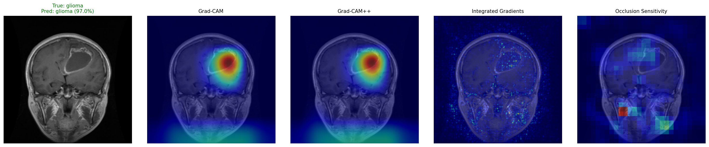
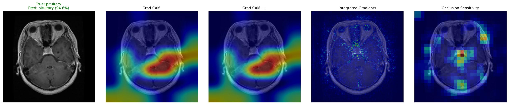
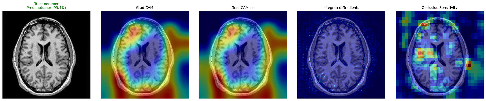
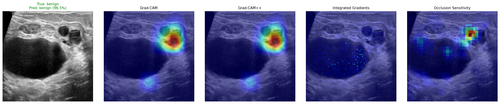
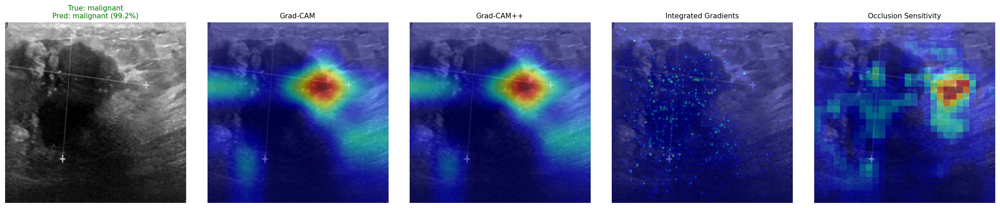

# Medical Imaging Classification with Explainable AI

Multi-class medical image classification using PyTorch transfer learning (ResNet50), with built-in explainability (Grad-CAM, Integrated Gradients, Occlusion Sensitivity) and a Streamlit web app for interactive predictions.

Two models are included:

| Model | Task | Classes | Dataset |
|-------|------|---------|---------|
| **Brain Tumor MRI** | Classify brain MRI scans | glioma, meningioma, notumor, pituitary | [Brain Tumor MRI Dataset](https://www.kaggle.com/datasets/masoudnickparvar/brain-tumor-mri-dataset) |
| **Breast Cancer Ultrasound** | Classify breast ultrasound images | benign, malignant, normal | [Breast Ultrasound Images (BUSI)](https://www.kaggle.com/datasets/aryashah2k/breast-ultrasound-images-dataset) |

---

## Quick Start

```bash
# 1. Train a model (auto-downloads dataset from Kaggle)
python train_brain_tumor.py
python train_breast_cancer.py

# 2. Generate XAI explanations
python explain_brain_tumor.py
python explain_breast_cancer.py

# 3. Launch the predictor web app
streamlit run predict_app.py
```

> **Kaggle credentials required** for auto-download. Place your `kaggle.json` in `~/.kaggle/` or pass `--kaggle_user` / `--kaggle_key` flags. See [Kaggle API docs](https://www.kaggle.com/docs/api).

---

## Results

### Brain Tumor MRI

- **Architecture:** ResNet50 (ImageNet V2 pretrained) with 2-layer MLP head
- **Training:** 20 epochs, AdamW, CosineAnnealingLR, class-weighted CrossEntropy with label smoothing
- **Classes:** glioma, meningioma, notumor, pituitary

**XAI sample predictions (7/8 correct on random test images):**

| Image | True Label | Predicted | Confidence |
|-------|-----------|-----------|------------|
| Te-gl_250.jpg | glioma | glioma | 97.0% |
| Te-me_12.jpg | meningioma | meningioma | 97.1% |
| Te-no_222.jpg | notumor | notumor | 95.4% |
| Te-pi_49.jpg | pituitary | pituitary | 94.6% |
| Te-pi_147.jpg | pituitary | pituitary | 98.2% |

### Breast Cancer Ultrasound

- **Architecture:** ResNet50 (ImageNet V2 pretrained) with 2-layer MLP head
- **Training:** 20 epochs, AdamW, CosineAnnealingLR, class-weighted CrossEntropy with label smoothing
- **Split:** Stratified 70/15/15 train/val/test (dataset has no predefined split)
- **Dataset size:** 780 images (437 benign, 210 malignant, 133 normal) after filtering mask files
- **Best validation accuracy:** 94.0%
- **Test macro AUROC:** 0.912

**Test set classification report:**

| Class | Precision | Recall | F1-Score | Support |
|-------|-----------|--------|----------|---------|
| benign | 0.875 | 0.848 | 0.862 | 66 |
| malignant | 0.808 | 0.677 | 0.737 | 31 |
| normal | 0.741 | 1.000 | 0.851 | 20 |
| **Accuracy** | | | **0.829** | **117** |

**Test set confusion matrix:**

|  | Pred: benign | Pred: malignant | Pred: normal |
|--|-------------|-----------------|-------------|
| **True: benign** | 56 | 5 | 5 |
| **True: malignant** | 8 | 21 | 2 |
| **True: normal** | 0 | 0 | 20 |

**Training curve:**

| Epoch | Train Loss | Val Loss | Train Acc | Val Acc |
|-------|-----------|----------|-----------|---------|
| 1 | 1.099 | 0.962 | 40.7% | 58.1% |
| 5 | 0.526 | 0.614 | 80.0% | 79.5% |
| 10 | 0.383 | 0.456 | 90.3% | 84.6% |
| 15 | 0.325 | 0.376 | 95.1% | **94.0%** |
| 20 | 0.303 | 0.378 | 95.6% | 91.5% |

---

## Explainable AI (XAI)

Each explanation image shows the original scan alongside four attribution methods, revealing which regions the model focuses on for its prediction:

- **Grad-CAM** — class-discriminative saliency from the last convolutional layer
- **Grad-CAM++** — weighted variant that better localizes multiple regions
- **Integrated Gradients** — pixel-level attribution by interpolating from a baseline
- **Occlusion Sensitivity** — sliding-patch perturbation to find critical regions

### Brain Tumor MRI Examples

**Glioma** (correctly classified, 97.0% confidence):



**Pituitary tumor** (correctly classified, 94.6% confidence):



**No tumor** (correctly classified, 95.4% confidence):



### Breast Cancer Ultrasound Examples

**Benign** (correctly classified, 96.5% confidence):



**Malignant** (correctly classified, 99.2% confidence):



> The full interactive HTML reports with all samples are generated at `artifacts/explanations/xai_report.html` and `artifacts_breast/explanations/xai_report.html`.

---

## Predictor Web App

A Streamlit web application that serves both models through a single interface.

**Features:**
- Sidebar model selector to switch between Brain Tumor MRI and Breast Cancer Ultrasound
- Drag-and-drop image upload (JPG, PNG, BMP, TIFF)
- Top prediction displayed with confidence score
- Color-coded probability bars for all classes
- Clinical warning for malignant predictions
- Models are cached in memory for instant subsequent predictions

**Launch:**
```bash
streamlit run predict_app.py
# Opens at http://localhost:8501
```

---

## Project Structure

```
.
├── train_brain_tumor.py        # Train brain tumor MRI classifier
├── train_breast_cancer.py      # Train breast cancer ultrasound classifier
├── explain_brain_tumor.py      # Generate XAI visualizations (brain tumor)
├── explain_breast_cancer.py    # Generate XAI visualizations (breast cancer)
├── predict_app.py              # Streamlit web app for both models
├── ML_Medical_Imaging_Tutorial.md  # Long-form tutorial document
├── CLAUDE.md                   # Codebase guide for Claude Code
│
├── artifacts/                  # Brain tumor outputs (gitignored)
│   ├── best_model.pt           #   Best checkpoint
│   ├── history.csv             #   Epoch-by-epoch metrics
│   ├── test_report.json        #   Classification report + confusion matrix
│   └── explanations/           #   XAI images + HTML report
│
├── artifacts_breast/           # Breast cancer outputs (gitignored)
│   ├── best_model.pt
│   ├── history.csv
│   ├── test_report.json
│   ├── test_images.csv         #   Held-out test paths for XAI
│   └── explanations/
│
├── data/                       # Brain tumor dataset (gitignored, auto-downloaded)
│   ├── Training/<class>/*.jpg
│   └── Testing/<class>/*.jpg
│
└── data_breast/                # Breast cancer dataset (gitignored, auto-downloaded)
    ├── benign/*.png
    ├── malignant/*.png
    └── normal/*.png
```

---

## Pipeline Architecture

Both training scripts follow the same end-to-end pipeline:

1. **Dataset acquisition** — auto-downloads from Kaggle via the CLI (never imports the Python `kaggle` module to avoid v1.6+ breakage)
2. **Image indexing** — walks class folders, verifies each image with `PIL.Image.verify()`, skips corrupt files
3. **Stratified splits** — Brain tumor uses the dataset's built-in Training/Testing folders (85/15 train/val split on Training); Breast cancer creates a 70/15/15 train/val/test split
4. **Transforms** — grayscale-to-3-channel conversion (for ImageNet weights), ImageNet normalization, augmentation on train only (flip, rotate, jitter, affine, RandomErasing)
5. **Model** — ResNet50 with ImageNet V2 weights; final `fc` replaced with Dropout(0.3) -> Linear(2048, 512) -> ReLU -> Dropout(0.3) -> Linear(512, num_classes)
6. **Training** — CrossEntropyLoss with class-frequency-inverse weights and label smoothing (0.05), AdamW optimizer, CosineAnnealingLR, mixed-precision (`torch.cuda.amp`) when CUDA is available
7. **Evaluation** — reloads best checkpoint (by val accuracy), computes classification report, confusion matrix, and macro OvR AUROC

---

## Requirements

- Python 3.10+
- PyTorch >= 2.0
- torchvision
- streamlit
- scikit-learn
- pandas, numpy, Pillow, tqdm, matplotlib

Install all dependencies:
```bash
pip install torch torchvision streamlit scikit-learn pandas numpy Pillow tqdm matplotlib
```

---

## Command Reference

```bash
# Train with default settings (20 epochs, batch 32, lr 3e-4, img 224)
python train_brain_tumor.py
python train_breast_cancer.py

# Override hyperparameters
python train_breast_cancer.py --epochs 30 --batch 16 --lr 1e-4 --img_size 256

# Pass Kaggle credentials inline
python train_brain_tumor.py --kaggle_user YOUR_NAME --kaggle_key YOUR_KEY

# Generate XAI for 16 test images
python explain_brain_tumor.py --n 16
python explain_breast_cancer.py --n 16

# Explain a single image
python explain_breast_cancer.py --image path/to/scan.png

# Launch predictor app
streamlit run predict_app.py
```

---

## Disclaimer

This project is for **educational and research purposes only**. It is not intended for clinical diagnosis. Always consult qualified medical professionals for clinical decisions.
