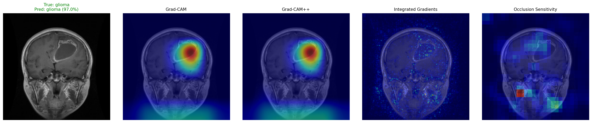

# Medical Imaging Classification with Explainable AI and MLOps

Transfer-learning classifiers for two medical imaging tasks, with attribution-based
explanations, experiment tracking, a containerised inference API, and a CI pipeline
that retrains and gates the model on every push.

| Task | Classes | Dataset |
|------|---------|---------|
| Brain tumour MRI | glioma, meningioma, notumor, pituitary | [Brain Tumor MRI Dataset](https://www.kaggle.com/datasets/masoudnickparvar/brain-tumor-mri-dataset) |
| Breast ultrasound | benign, malignant, normal | [Breast Ultrasound Images (BUSI)](https://www.kaggle.com/datasets/aryashah2k/breast-ultrasound-images-dataset) |

Both use ResNet50 with ImageNet V2 weights and a two-layer MLP head, trained with
class-weighted cross-entropy and label smoothing on stratified splits.

> Educational and research use only. Not for clinical diagnosis.

---

## Quick start

```bash
pip install -r requirements.txt

# Train through the full MLOps pipeline (auto-downloads from Kaggle)
python mlops_pipeline.py --task brain_tumor
python mlops_pipeline.py --task breast_cancer

# Generate explanations for held-out test images
python explain.py --task brain_tumor --n 16
python explain.py --task breast_cancer --n 16

# Serve the trained models
uvicorn serve:app --port 8000

# Or run the Streamlit front ends
streamlit run patient_app.py     # patient-facing predictor
streamlit run dashboard.py       # MLOps monitoring view
```

Kaggle credentials are required for the dataset download. Place `kaggle.json` in
`~/.kaggle/`, or pass `--kaggle_user` and `--kaggle_key`.

---

## Results, breast ultrasound

780 images (437 benign, 210 malignant, 133 normal), stratified 70/15/15 split.

- Best validation accuracy: 94.0%
- Test macro AUROC: 0.912
- Test accuracy: 82.9% on 117 held-out images

| Class | Precision | Recall | F1 | Support |
|-------|-----------|--------|-----|---------|
| benign | 0.875 | 0.848 | 0.862 | 66 |
| malignant | 0.808 | 0.677 | 0.737 | 31 |
| normal | 0.741 | 1.000 | 0.851 | 20 |

Recall on the malignant class is the weak point at 0.677. Eight of 31 malignant
cases are predicted benign, which is the costly error direction for this task.
Raising malignant recall is the open work item.

---

## Explainability

`explain.py --task <task>` produces four attributions per image for images from the
held-out test split (`test_images.csv`, written by the pipeline), saved to
`artifacts_*/explanations/` with an HTML report:

- Grad-CAM, class-discriminative saliency from the last convolutional block
- Grad-CAM++, weighted variant that localises multiple regions better
- Integrated Gradients, pixel attribution interpolated from a baseline
- Occlusion Sensitivity, sliding-patch perturbation



---

## Pipeline

`mlops_pipeline.py` runs the full path for either task:

1. Download the dataset from Kaggle
2. Index images, verify each with `PIL.Image.verify()`, skip corrupt files
3. Validate the data and record class balance
4. Build stratified splits and transforms, augmenting the training split only
5. Train with AdamW, CosineAnnealingLR, early stopping, mixed precision on CUDA
6. Log parameters, metrics and artifacts to MLflow
7. Evaluate the best checkpoint, writing `test_report.json` and `history.csv`
8. Apply the quality gate, controlled by `--min_val_acc` and `--min_auroc`
9. Export TorchScript for serving

Datasets are versioned with DVC against an Azure Blob Storage remote
(`data.dvc`, `data_breast.dvc`).

---

## Serving

`serve.py` is a FastAPI app sharing `model.py` with the training pipeline.

| Method | Route | Purpose |
|--------|-------|---------|
| GET | `/health` | liveness probe |
| POST | `/predict/brain_tumor` | brain MRI, 4 classes |
| POST | `/predict/breast_cancer` | breast ultrasound, 3 classes |

```bash
docker build -t medical-imaging-api:v1 .
docker run -p 8000:8000 medical-imaging-api:v1

# Classify a folder against the running server
python batch_predict.py --folder data/Testing/glioma --task brain_tumor --out results.csv
```

---

## Continuous integration

`.github/workflows/mlops.yml` runs on pushes touching the pipeline, model, server,
requirements or Dockerfile, and on manual dispatch:

1. Trains `--task brain_tumor` for **one epoch** as a smoke test, not to convergence
2. Fails the build if test accuracy falls below the 30% smoke-test threshold
3. Uploads the checkpoint, TorchScript export and reports as build artifacts
4. Builds the Docker image in a second job, gated on the first passing

The thresholds are deliberately low because CI verifies that the pipeline runs end
to end on CPU, not that the model is good. Real training runs happen locally on GPU.
Azure Container Registry push is documented in `AZURE_GUIDE.md` but not enabled.

---

## Layout

```
mlops_pipeline.py           Training pipeline, --task brain_tumor|breast_cancer
model.py                    Shared ResNet50 definition + checkpoint loader
explain.py                  Attribution maps, --task brain_tumor|breast_cancer
serve.py                    FastAPI inference server
batch_predict.py            Batch client for the server
patient_app.py              Streamlit predictor, patient-facing
dashboard.py                Streamlit MLOps monitoring view
Dockerfile                  Serving image
docs/                       Example explanation images
documentation/              Stage-by-stage reference docs for the pipeline
AZURE_GUIDE.md              Azure deployment notes
DEPLOYMENT_GUIDE.md         Deployment walkthrough
MLOPS_GUIDE.md              Pipeline notes

artifacts_brain/            Brain tumour outputs (gitignored)
artifacts_breast/           Breast ultrasound outputs (gitignored)
data/, data_breast/         Datasets, DVC-tracked (gitignored)
```

---

## Requirements

Python 3.10 or later, PyTorch 2.0 or later. See `requirements.txt` for the training
and pipeline set, `requirements-app.txt` for the Streamlit apps alone.

---

## Known issues

- Malignant recall of 0.677 needs work before the breast model is useful.
